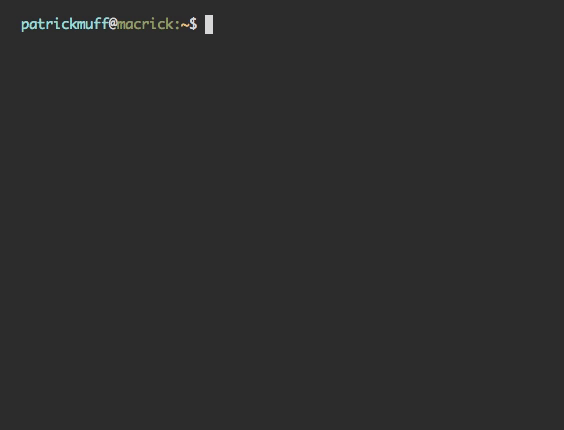

# ts-pwgen

Command-Line Password Generator in TypeScript

[](https://www.npmjs.com/package/ts-pwgen) [](https://www.npmjs.com/package/ts-pwgen)

## Installation

```
npm install -g ts-pwgen
```

## Good to know

- It has a default password length of 30 characters
- It uses lowercase/uppercase letters, numbers and special characters when you don't pass any arguments saying otherwise
- It uses [`crypto.randomBytes()`](https://nodejs.org/api/crypto.html#crypto_crypto_randombytes_size_callback) instead of `Math.random()`.
- You should try the `--verbose` flag to see how long it would take a supercomputer (10^12 pw/sec) to crack your generated password
- Use `-k` if you don't like the copy-to-clipboard feature

## Demo



## Usage

```
pwgen --help
```

```
Usage: pwgen [--length 10] [--parts 3] [--delimiter "-"] [--count 3] [-aAns]

Options:
  -p, --parts      Define how many parts there should be
  -l, --length     Define the length of a part
  -d, --delimiter  Define the delimiter to use if there are multiple parts
  -c, --count      Define how many passwords to generate           [Standard: 1]
  -a, --ascii      Use lowercase letters                               [boolean]
  -A, --ASCII      Use uppercase letters                               [boolean]
  -n, --numbers    Use numbers                                         [boolean]
  -s, --special    Use special characters                              [boolean]
  -x, --latin1     Use latin1 characters                               [boolean]
  -v, --verbose    Verbose output, see how long it would take a supercomputer to
                   crack your generated password(s)  [boolean] [Standard: false]
  -k               Do not copy the password to the clipboard
                                                     [boolean] [Standard: false]
  --version        Display current version                             [boolean]
  -h, --help       Show help                                           [boolean]
```

## Examples

### Custom length

`pwgen -l 16` or `pwgen --length 16` or `pwgen --length=16`

```
-TI)!9~GmQm~a=jj
```

### Parts with delimiter

`pwgen --parts=3 --length=5 --delimiter="-"`

```
1TX)C-rivp<-MWvZ5
```

#### ProTip: Use parts for WiFi-friendly passwords

`pwgen -p 4 -l 5 -an`

```
jhnxp-geehp-rtz2n-3m4vt
```

The delimiter defaults to `-`.

### See how long it would take a supercomputer to crack your password

`pwgen -l 16 -v`

```
Password length:       16
Different characters:  91
Possible combinations: 2.211374397284394e+31

Required time to crack (10^12 passwords/s)
              Seconds: 11056871986421970000
                Years: 350566645098.98
  Age of the universe: 25.71

a*aO)~}xv|4s+Z4*

Password successfully copied to clipboard!
```

### Create multiple passwords

`pwgen -c 5`

```
@T:6Z8}5G"dIENbab^qvh;^}##LY{F
3Qy7@`&Ujh;aQL0dMz%@M(IfswdLfa
Sg5O+@L<:Ni1E>k<F>{,XvS|{Y|^W|
ZKf/]e-unOP8YWPv4W@eYe*yL6{lk}
N^)@rFD+1F-G!v%UZcxeV)FzIMfn]]
```

### Use lowercase letters only

`pwgen -a`

```
jpgthoyjmwumnoiroqynbhywoxhjnb
```

### Use uppercase letters only

`pwgen -A`

```
AUAYYZJXWMIKMPJGHVQSPKUGPUFTCU
```

### Use numbers only

`pwgen -n`

```
647681199479680747570268980919
```

### Use special characters only

`pwgen -s`

```
=<}(<>}/,_.*@:|<*++"=)^;^:|)_+
```

### Use latin1 characters only

`pwgen -x`

```
»°ÃÑîÍí¢ÆñÓò¾ÅÚïñ°ÕÔÏúñ¼Ï´¦îÓê
```

### Use letters and numbers (combine charsets)

`pwgen -aAn`

```
APlngye5IiXTu0z7NETffgS67bOX48
```

## Development

### Unit tests

```
npm test
```

### Build from TypeScript source

```
npm run build
```
